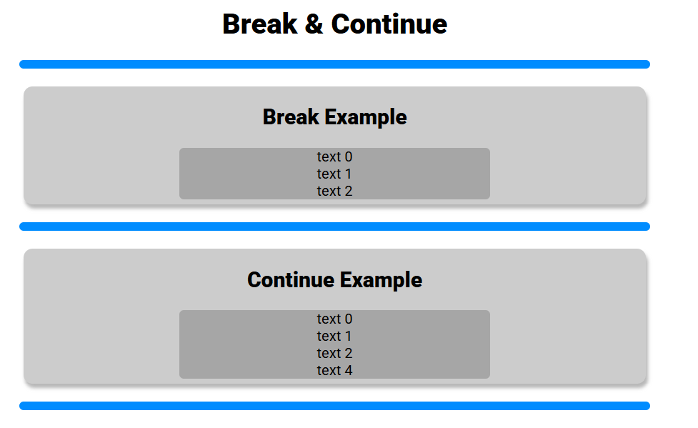

# Break, Continue

## Mục lục

## Định nghĩa

Sử dụng để điều khiển luồng code thực thi trong một vòng lặp. Cụ thể:

- `break`: dừng hẳn
- `continue`: bỏ qua vòng đang thực thi

## Break

Ví dụ:

```js
// Break Example
let breakText = "";
for (let i = 0; i < 5; i++) {
  if (i === 3) {
    break;
  }
  breakText += `text ${i} ${"<br>"}`;
}

document.getElementById("break").innerHTML = breakText;
```

Kết quả:


## Continue

Ví dụ:

```js
// Continue Example
let continueText = "";

for (let i = 0; i < 5; i++) {
  if (i === 3) {
    continue;
  }
  continueText += `text ${i} ${"<br>"}`;
}

document.getElementById("continue").innerHTML = continueText;
```

Kết quả:



## Cấu trúc source code

```
js_course/
├─ src/
│  ├─ chapter_01/
│  └─ chapter_02/
│         ├─ image.png
│         ├─ image-1.png
│         ├─ lec_07/
│         └─ lec_08/
│             ├─ index_08.html
│             ├─ break_continue.md
│             └─ js/
│               ├─ break.js
│               └─ continue.js
└─ README.md
```
