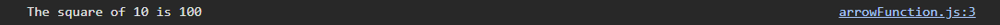

# Function

## Mục lục

- [Function](#function)
  - [Mục lục](#mục-lục)
  - [Định nghĩa](#định-nghĩa)

## Định nghĩa

`Function` (hàm):

- là một khối mã có tên và thực hiện một chức năng hoặc nhiệm vụ nào đó.
- Được tái sử dụng và tổ chức code một cách hiệu quả và dễ quản lý.
- Chạy khi được gọi tên.

## Syntax

Đây là syntax cơ bản của `function` trong **javascript**:

```js
function name(p1, p2, p3) {
  // code
}
```

Với:

- `function`: **keyword** sử dụng để định nghĩa một hàm (bắt buộc)
- `name`: tên được người dùng đặt hoặc được xây dựng sẵn và gọi ra sử dụng.
- `p1`, `p2`, `p3`: Là các **tham số** (**parameters**) và hàm có thể có hoặc không có tuỳ thuộc vào chức năng hay dụng ý của người sử dụng (không bắt buộc).
- **// code**: là đoạn mã được thực thi bên trong hàm.
- Ngoài ra, hàm có thể trả về giá trị nào đó - gọi là hàm `return`

**Lưu ý**: Nếu sử dụng **tham số** thì khi gọi lại hàm thì có bao nhiêu **tham số** phải sử dụng bấy nhiêu **đối số** (`arguments`) để truyền vào.

Ví dụ:

```js
let x = function square(num) {
  return num * num;
};

console.log(`The square of 5 is ${x(5)}`);
```

Kết quả:


## Arrow Function

Là một cách viết ngắn gọn hơn với function syntax.

Link tài liệu tham khảo:

- [https://developer.mozilla.org/en-US/docs/Web/JavaScript/Reference/Functions/Arrow\_](https://developer.mozilla.org/en-US/docs/Web/JavaScript/Reference/Functions/Arrow_)
- [Immediately Invoked Function Expression / anonymous function](https://developer.mozilla.org/en-US/docs/Glossary/IIFE)

Xem ví dụ dưới đây:

```js
let square = (variable) => variable * variable;

console.log(`The square of 10 is ${square(10)}`);
```

Kết quả:

